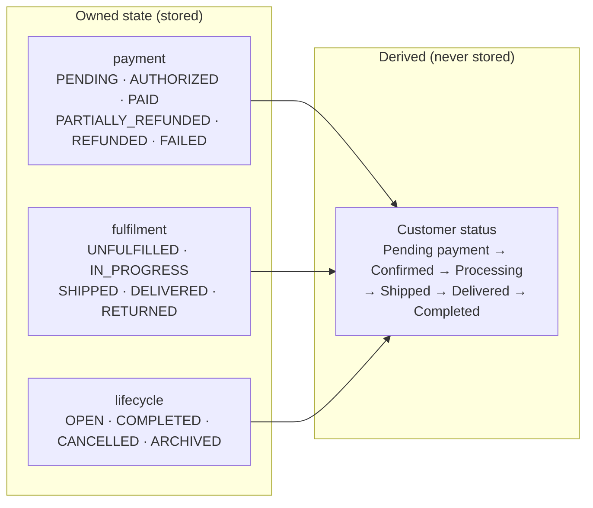
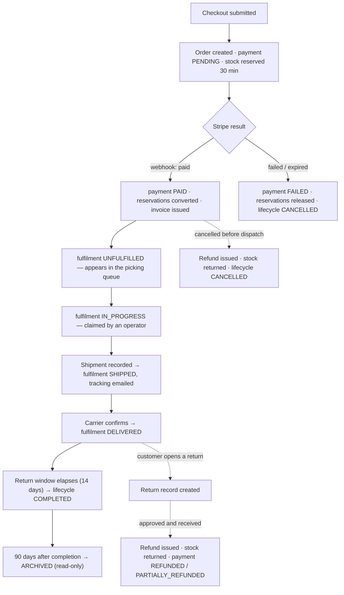
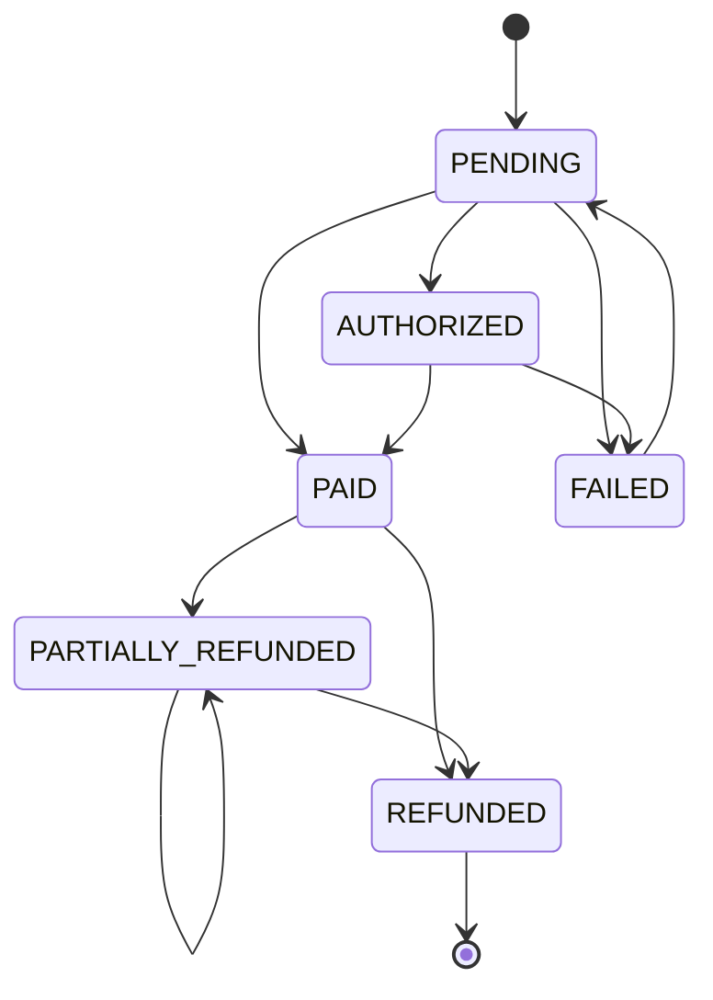
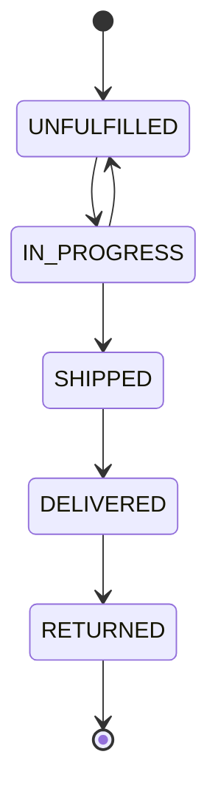
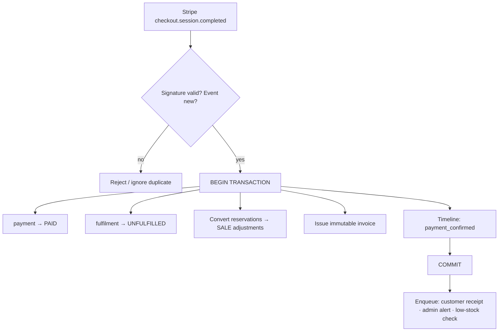
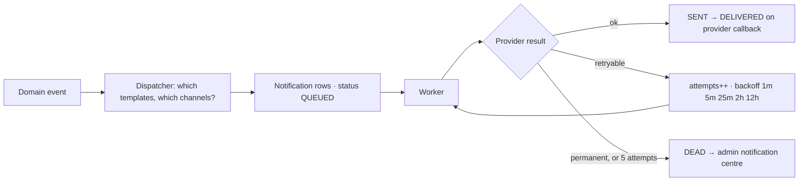

# Order Management System — Redesign

**Date** 23 July 2026 · **Branch** `master` · **Scope** checkout → payment → fulfilment → delivery → returns → archive

This document analyses the order system as it exists, then specifies a replacement. Every claim
about current behaviour was verified against the source; file and line references are included so
each can be checked. No code has been changed.

**Companion document** — [`order-management-audit.md`](./order-management-audit.md) covers security
and correctness defects in the current implementation. This document covers design. Where a defect
is dissolved by the redesign rather than patched, it is cross-referenced.

---

## Stack correction (read first)

Three assumptions in the brief do not hold, and each changes what can be recommended.

| Assumed      | Verified reality                                                                                                                                   | Consequence for this design                                                                                                                                                                                                                             |
| ------------ | -------------------------------------------------------------------------------------------------------------------------------------------------- | ------------------------------------------------------------------------------------------------------------------------------------------------------------------------------------------------------------------------------------------------------- |
| shadcn/ui    | Not installed. No `components.json`, zero `@radix-ui` imports, no `class-variance-authority`. `src/components/ui/` contains one file.              | Every "use a shadcn Dialog/Table/Command" recommendation is a **migration project**, not a drop-in. Phase 7/8 are specified so they work with or without it.                                                                                            |
| Supabase     | `@supabase/supabase-js` **not installed**. Supabase is hosted Postgres reached through Prisma + `@prisma/adapter-pg`.                              | **Row Level Security is not an available control.** Prisma connects as one Postgres role; RLS policies would be bypassed wholesale. Supabase Realtime is likewise unavailable. Both are named in the brief; both are struck from the plan and replaced. |
| Tailwind CSS | Installed (v4) and imported, but only 32 of 99 `.tsx` files use utilities. The design system is 4,886 lines of hand-authored CSS in `globals.css`. | The admin is not a Tailwind codebase. Redesign proposals stay in the existing CSS idiom; a Tailwind/shadcn migration is listed as separate, optional work.                                                                                              |

Confirmed as stated: Next.js 16.2.10, React 19.2.4, TypeScript 5, Prisma 7.8, Zod 4, Stripe 22.3,
better-auth 1.6, next-intl 4.13.

---

# PHASE 1 — Analysis of the existing flow

## 1.1 The root cause: one field carrying three unrelated jobs

`OrderStatus` has eleven members that answer three different questions at once:

```
PENDING_PAYMENT  PAYMENT_FAILED          ← has the money arrived?
PAID  PROCESSING  PACKED  SHIPPED  DELIVERED   ← where are the goods?
CANCELLED  REFUNDED  PARTIALLY_REFUNDED  RETURN_REQUESTED  ← how did it end?
```

**Why this exists.** The enum grew one member at a time as features landed. Each addition was
locally reasonable. Nobody stepped back and asked whether a single field should answer three
questions, so the axes fused.

**Why it hurts.** An order that is paid _and_ shipped _and_ partially refunded has one field and
three true answers. The field can only hold one, so the other two facts are lost or smeared into
adjacent columns. Every downstream consumer — badge, filter, email, transition table — then has to
reconstruct what the field failed to record.

This single decision produces most of the problems below.

## 1.2 Duplicated state that is allowed to disagree

`OrderStatus` and `PaymentStatus` both contain `PAID`, `REFUNDED`, `PARTIALLY_REFUNDED`, and
`CANCELLED`. The same fact is stored twice, in two columns, written by seven different code paths:

| Write site                                  | Sets `status` | Sets `paymentStatus` |
| ------------------------------------------- | ------------- | -------------------- |
| `services/payment-confirmation.ts:60`       | ✅ PAID       | ✅ PAID              |
| `actions/admin.ts:1505` (refund)            | ✅ REFUNDED   | ✅ REFUNDED          |
| `api/stripe/webhook/route.ts:155`           | ✅ REFUNDED   | ✅ REFUNDED          |
| `api/stripe/webhook/route.ts:112`           | ❌            | ✅ FAILED            |
| `api/checkout/route.ts:345`                 | ✅ CANCELLED  | ✅ CANCELLED         |
| `api/cron/reservations/route.ts:60`         | ❌            | ✅ CANCELLED         |
| **`actions/admin.ts:980` (admin dropdown)** | ✅ _anything_ | ❌ **never**         |

**Verified defect.** The state machine permits `PAID → REFUNDED`, and the admin dropdown now offers
every permitted transition. `transitionOrderAction` writes `status` only. So an administrator
selecting **REFUNDED** produces:

- `order.status = REFUNDED` — the admin panel and the customer's order page both say refunded
- `order.paymentStatus = PAID` — unchanged
- **no Stripe refund is issued; no money moves; no `Refund` row exists**

The order tells the customer they were refunded when they were not. This is reachable through the
UI in two clicks. It is the most serious functional defect in the system and it exists _because_
the same fact lives in two columns with no invariant tying them together.

**Why it exists.** `transitionOrderAction` was written for fulfilment transitions, where touching
`paymentStatus` would be wrong. Money-affecting statuses were later added to the same enum, and the
action was never taught the difference — because the enum offers no way to tell the difference.

## 1.3 Statuses that carry no business meaning

| Status               | Verdict                       | Reasoning                                                                                                                                                                                 |
| -------------------- | ----------------------------- | ----------------------------------------------------------------------------------------------------------------------------------------------------------------------------------------- |
| `PACKED`             | **Remove**                    | Six SKUs, one location. The gap between "picking" and "packed" is minutes and no decision hangs on it. It exists because the enum was modelled on a multi-warehouse WMS this shop is not. |
| `PROCESSING`         | **Keep, rename**              | Real and useful — "we have it, we are working on it". Becomes fulfilment `IN_PROGRESS`.                                                                                                   |
| `RETURN_REQUESTED`   | **Move**                      | A return is a _record with lines, a reason, and a resolution_, not an order status. As a status it cannot express a partial return, and there is no `Return` model to hold one.           |
| `PARTIALLY_REFUNDED` | **Move to payment axis only** | Belongs to money, never to fulfilment. Its presence on `OrderStatus` is what forces the dual write in 1.2.                                                                                |
| `PAYMENT_FAILED`     | **Move to payment axis only** | Same reasoning.                                                                                                                                                                           |
| `PAID`               | **Move to payment axis only** | Same reasoning. On the fulfilment axis the equivalent is simply `UNFULFILLED`.                                                                                                            |

Eleven statuses, of which **one** (`PACKED`) is pure overhead and **five** are on the wrong axis.

## 1.4 Actions that should be automatic but are manual

| Today                                                                                                                     | Should be                                                                          |
| ------------------------------------------------------------------------------------------------------------------------- | ---------------------------------------------------------------------------------- |
| Admin adds tracking, then separately sets status to SHIPPED — two forms, two submits, easy to do one and forget the other | Recording a shipment **is** the act of shipping. One action; status follows.       |
| Nothing restocks inventory on cancel or refund (audit 04)                                                                 | Cancelling or refunding proposes a restock, defaulted on, one checkbox to decline. |
| Cancelling an unpaid order leaves stock reserved for up to 30 minutes (audit 13)                                          | Cancel releases reservations in the same transaction.                              |
| No invoice exists anywhere in the schema                                                                                  | Invoice generated on payment, immutable, downloadable by the customer.             |
| Admin has no idea whether the customer was emailed                                                                        | Every notification writes a timeline event with its delivery outcome.              |

## 1.5 Screens

**Order list** (`app/admin/orders/page.tsx`)

- Pagination is computed but **no controls are rendered** — `grep -c "href.*page=" → 0`. Order 26
  onward is unreachable without hand-editing the URL (audit 06).
- One status column showing a fused value, so "unpaid" and "unshipped" cannot be filtered
  independently — the two questions a fulfilment operator actually asks each morning.
- No bulk actions, no saved views, no keyboard access, no row preview. Every inspection is a full
  page navigation and a back-button.

**Order detail** (`app/admin/orders/[id]/page.tsx`)

- Three separate forms (status, tracking, refund) stacked vertically, each with its own submit.
  The page is roughly 2,000px tall; the timeline — the first thing anyone opens an order to read —
  is at the very bottom.
- The refund form and the status dropdown can both produce "refunded", by different mechanisms,
  with different side effects. Only one of them moves money (1.2).

## 1.6 Naming inconsistencies

`PENDING_PAYMENT` (order) vs `PENDING` (payment) vs `LABEL_CREATED` (shipment) — three tenses and
two vocabularies. `Shipment.status` has a rich enum but only ever holds `LABEL_CREATED`; nothing
advances it (audit 11). `AdjustmentType.RETURN` is declared in the schema and used nowhere.

## 1.7 Missing models

No `Return`. No `Notification`. No `Invoice`. Phases 10–12 of the brief assume all three.

---

# PHASE 2 — The redesigned lifecycle

## 2.1 Principle: three orthogonal axes, one derived label

Two axes are **owned** — something writes them, and only one thing may. A third is **derived** —
computed from the other two, never stored, never editable.



**Why this is the right shape.** It is the model Shopify (`financial_status` +
`fulfillment_status` + `status`) and Stripe both converged on, for the reason that it makes
contradiction _unrepresentable_. "Paid and shipped and partially refunded" is three fields with
three values — not one field losing two facts. The defect in 1.2 cannot be written down in this
model, because there is no single field an administrator could set to "refunded".

**Your proposed chain is preserved exactly** — as the derived customer label. You asked for
Pending Payment → Confirmed → Processing → Shipped → Delivered → Completed. That is precisely what
the derivation produces. The change is that it becomes a _computed projection_ rather than a
column anyone can set, which is what makes it trustworthy.

## 2.2 Full lifecycle



**On "Draft".** You listed it as optional. Recommendation: **do not build it yet.** Draft orders
exist to let staff compose an order on a customer's behalf (phone/B2B). Nothing in this codebase
does that today. Adding the state now means every query, filter, and badge must handle a case that
never occurs. Revisit when wholesale ordering is built — it is the feature that will actually need
it.

**On "Picking" and "Packing" as separate states.** Collapsed into `IN_PROGRESS`. With six SKUs and
one location, no decision differs between them, and each extra state multiplies the transition
table. If a warehouse with zones ever exists, add `pickedAt` / `packedAt` **timestamps** — they
record the same information without adding states.

**On "Completed" as distinct from "Delivered".** Justified, and worth keeping. `DELIVERED` means
the parcel arrived. `COMPLETED` means the return window has closed and the money is finally the
shop's. They differ by 14 days, and revenue recognition and archival both depend on the second,
not the first.

---

# PHASE 3 — Simplified statuses

## 3.1 Payment (owned by Stripe; manual override audited)

| Status               | Meaning                        | Who may set it                                                         |
| -------------------- | ------------------------------ | ---------------------------------------------------------------------- |
| `PENDING`            | Checkout created, no money yet | System, at order creation                                              |
| `AUTHORIZED`         | Funds held, not captured       | Stripe webhook                                                         |
| `PAID`               | Captured                       | Stripe webhook, or admin for bank transfer / cash — audited separately |
| `PARTIALLY_REFUNDED` | Some money returned            | Refund service only                                                    |
| `REFUNDED`           | All money returned             | Refund service only                                                    |
| `FAILED`             | Payment did not complete       | Stripe webhook                                                         |

## 3.2 Fulfilment (owned by staff)

| Status        | Meaning                    | Who may set it                                          |
| ------------- | -------------------------- | ------------------------------------------------------- |
| `UNFULFILLED` | Paid, not yet picked       | System, on payment                                      |
| `IN_PROGRESS` | Claimed and being prepared | Admin                                                   |
| `SHIPPED`     | Handed to carrier          | **Derived from shipment creation** — never set directly |
| `DELIVERED`   | Carrier confirmed          | Carrier webhook, or admin                               |
| `RETURNED`    | Goods physically back      | Return service only                                     |

## 3.3 Lifecycle (envelope)

| Status      | Meaning                          |
| ----------- | -------------------------------- |
| `OPEN`      | Active                           |
| `COMPLETED` | Delivered + return window closed |
| `CANCELLED` | Terminated before delivery       |
| `ARCHIVED`  | Read-only, out of working views  |

## 3.4 Derived customer status

Pure function, no storage:

```ts
if (lifecycle === "CANCELLED") return "Cancelled";
if (payment === "REFUNDED") return "Refunded";
if (payment === "FAILED") return "Payment failed";
if (payment === "PENDING") return "Pending payment";
if (fulfilment === "RETURNED") return "Returned";
if (fulfilment === "DELIVERED")
  return lifecycle === "COMPLETED" ? "Completed" : "Delivered";
if (fulfilment === "SHIPPED") return "Shipped";
if (fulfilment === "IN_PROGRESS") return "Processing";
return "Confirmed";
```

**Six visible statuses**, down from eleven — and none of them is directly settable, so none can
lie.

## 3.5 Visibility

| Axis                              | Customer sees               | Admin sees     |
| --------------------------------- | --------------------------- | -------------- |
| Derived status                    | ✅                          | ✅             |
| Payment                           | ✅ (as "Paid" / "Refunded") | ✅ full detail |
| Fulfilment                        | ⚠️ only via derived label   | ✅             |
| Lifecycle                         | ❌                          | ✅             |
| Internal notes, audit log, margin | ❌                          | ✅             |

## 3.6 Never manually editable

1. **`SHIPPED`** — a side effect of recording a shipment. Settable directly, it produces "shipped"
   orders with no tracking number, and the customer gets an email with nothing in it.
2. **`REFUNDED` / `PARTIALLY_REFUNDED`** — outputs of the refund service. This is exactly the
   defect in 1.2.
3. **`RETURNED`** — output of the return service.
4. **`COMPLETED`** — a function of time.
5. **Derived status** — has no column to edit.

`PAID` is the sole deliberate exception: bank transfer and cash-on-collection are real, so it stays
manually settable but routes through the same settlement service as the webhook and is logged as a
distinct audit action.

---

# PHASE 4 — Transition rules

## 4.1 Payment



| Transition                      | Trigger                           | Why                                                |
| ------------------------------- | --------------------------------- | -------------------------------------------------- |
| `PENDING → PAID`                | Stripe webhook, or audited manual | The only path that converts reservations to a sale |
| `PENDING → FAILED`              | Stripe, or reservation expiry     | Releases stock                                     |
| `PAID → PARTIALLY_REFUNDED`     | Refund service                    | Requires a settled Stripe refund first             |
| `PARTIALLY_REFUNDED → REFUNDED` | Refund service                    | When cumulative refunds reach the captured total   |
| `FAILED → PENDING`              | Customer retries checkout         | Same order, new payment attempt                    |

**Forbidden and why:** `PENDING → REFUNDED` (nothing to refund); `REFUNDED → anything` (terminal);
any transition into `PAID` that skips the settlement service (would leave stock reserved forever).

## 4.2 Fulfilment



| Transition                  | Trigger                  | Guard                              |
| --------------------------- | ------------------------ | ---------------------------------- |
| `UNFULFILLED → IN_PROGRESS` | Admin claims the order   | **Payment must be `PAID`**         |
| `IN_PROGRESS → UNFULFILLED` | Admin releases the claim | Records who and why                |
| `IN_PROGRESS → SHIPPED`     | Shipment recorded        | Requires carrier + tracking number |
| `SHIPPED → DELIVERED`       | Carrier webhook or admin | —                                  |
| `DELIVERED → RETURNED`      | Return received          | Requires an approved `Return`      |

**The critical guard:** fulfilment cannot leave `UNFULFILLED` while payment is `PENDING`. This is
the invariant that makes the current "which statuses can I pick?" confusion disappear — the answer
is derived from the payment axis instead of being a hand-maintained filter list.

**Forbidden and why:** `UNFULFILLED → SHIPPED` (nothing was picked; also skips the tracking
requirement); `SHIPPED → IN_PROGRESS` (the parcel is gone — issue a return instead); `DELIVERED →
SHIPPED` (rewriting history; correct by voiding the shipment).

## 4.3 Lifecycle

| Transition             | Trigger                     | Guard                                               |
| ---------------------- | --------------------------- | --------------------------------------------------- |
| `OPEN → CANCELLED`     | Admin or expiry             | Blocked once fulfilment is `SHIPPED` — use a return |
| `OPEN → COMPLETED`     | Job, 14 days after delivery | Requires `DELIVERED` and no open return             |
| `COMPLETED → ARCHIVED` | Job, 90 days later          | Read-only thereafter                                |
| `CANCELLED → ARCHIVED` | Job, 90 days later          | —                                                   |

## 4.4 Enforcement

Three layers, because any one alone fails:

1. **Database** — a `CHECK` constraint rejecting impossible combinations
   (`fulfilment != 'UNFULFILLED' AND payment = 'PENDING'`). Survives bugs, migrations, and manual
   SQL.
2. **Service** — `assertTransition()` inside the same transaction as the write, after a
   `SELECT … FOR UPDATE`.
3. **UI** — only legal options rendered. A convenience, never a control.

The current code has layer 2 only, and only for `status`.

---

# PHASE 5 — Automation

## 5.1 Payment confirmed



Everything that must be consistent is inside the transaction. Everything that can be retried is
outside it, on a queue. **Email is never sent inside a transaction** — an SMTP timeout must not
roll back a payment.

## 5.2 Shipment recorded

One admin action, six effects: shipment row → fulfilment `SHIPPED` → `shippedAt` stamped →
timeline event → tracking email → carrier-webhook subscription. The two-step "add tracking, then
remember to change status" dance is deleted.

## 5.3 Refund settled

Restock → credit note → `payment` recomputed from cumulative refunds (never assigned literally) →
timeline → customer notification.

## 5.4 Scheduled

| Job                          | Cadence | Action                                            |
| ---------------------------- | ------- | ------------------------------------------------- |
| Release expired reservations | 15 min  | Exists today; keep                                |
| Close return window          | hourly  | `DELIVERED` + 14d + no open return → `COMPLETED`  |
| Archive                      | daily   | `COMPLETED`/`CANCELLED` + 90d → `ARCHIVED`        |
| Retry failed notifications   | 5 min   | Exponential backoff, 5 attempts, then dead-letter |
| Stalled-order alert          | hourly  | `PAID` + `UNFULFILLED` > 48h → notify admin       |

---

# PHASE 6 — Order timeline

## 6.1 Model

```prisma
model OrderEvent {
  id          String       @id @default(cuid())
  orderId     String
  type        OrderEventType     // PAYMENT_CONFIRMED, SHIPMENT_CREATED, …
  actorType   ActorType          // SYSTEM | ADMIN | CUSTOMER | WEBHOOK | API | JOB
  actorId     String?
  actorLabel  String             // "Akif Ullah" / "Stripe" / "reservation-sweeper"
  summary     String             // one line, customer-safe
  detail      Json?              // structured before/after
  reason      String?
  visibility  EventVisibility    // PUBLIC | INTERNAL
  ipAddress   String?
  userAgent   String?
  correlationId String?
  createdAt   DateTime     @default(now())

  @@index([orderId, createdAt])
  @@index([orderId, visibility, createdAt])
}
```

**Why this replaces `OrderStatusHistory`.** The current table records status changes only — roughly
a fifth of what actually happens to an order. Emails sent, invoices issued, notes added, refunds
settled, stock adjusted: none appear. `visibility` lets one table serve both the admin timeline and
the customer timeline, which guarantees they cannot drift apart.

**Why `actorLabel` is denormalised.** A timeline must remain readable after the staff account that
wrote it is deleted. The FK may go null; the name stays.

## 6.2 Rendering

```
Today
 14:35  Order placed                              Customer · 203.0.113.4 · Chrome/Android
 14:35  Payment confirmed         €14.98          Stripe webhook · evt_1P…
 14:35  Invoice KDF-2026-0001 issued              System
 14:36  Receipt emailed           delivered       System · akifullah0317@gmail.com
 09:12  Picking started                           Akif Ullah
 09:20  Shipped                   DHL 0034043…    Akif Ullah · tracking emailed
```

Grouped by day, timestamps at a fixed gutter so the eye scans one column, actor always on the
right, internal-only rows tinted and filterable. Delivery outcome shown inline — the admin never
has to wonder whether the customer was told.

---

# PHASE 7 — Admin order page

## 7.1 Layout

```
┌────────────────────────────────────────────────────────────────────────┐
│ ← Orders    KDF-2026-1ED9D160        [Paid] [Unfulfilled]   ⌘K  ⋯     │
│ Akif Ullah · akifullah0317@gmail.com · 23 Jul 2026, 14:35              │
│ ┌──────────────────────────────────────────────────────────────────┐   │
│ │  ▶ Start picking          Refund…    Cancel order…    Print      │   │  ← primary action
│ └──────────────────────────────────────────────────────────────────┘   │     is ONE button
├──────────────────────────────────────┬─────────────────────────────────┤
│ ITEMS                    €14.98      │ CUSTOMER                        │
│  1× Dried Apricots 500g   €9.99      │  Akif Ullah · Guest             │
│     DEV-DRIED-APRICOTS-500           │  akifullah0317@gmail.com        │
│  Shipping                 €4.99      │  1 previous order               │
│  VAT included             €0.65      │                                 │
│  ─────────────────────────────       │ DELIVERY                        │
│  Total                   €14.98      │  Akif Ullah, CreateaWeb         │
│  Paid 23 Jul · Refunded —            │  Charsadda, 24420 · DE          │
├──────────────────────────────────────┤  +92 317 6186273                │
│ TIMELINE            [All ▾]          │                                 │
│  14:35 Order placed        Customer  │ PAYMENT                         │
│  14:35 Payment confirmed   Stripe    │  Stripe · pi_3P… ↗              │
│  14:36 Receipt emailed  delivered    │  Captured €14.98                │
│  …                                   │                                 │
└──────────────────────────────────────┴─────────────────────────────────┘
```

## 7.2 Decisions and why

**One primary action, not three forms.** The header shows exactly one next step, computed from
state: unfulfilled → _Start picking_; in progress → _Record shipment_; shipped → _Mark delivered_.
The current page presents three co-equal forms and lets the operator work out which applies. An
operator processing forty orders should never have to think about that.

**Destructive actions are separated and typed.** Refund and Cancel open a dialog with a
consequence summary ("Refunds €14.98 to the original card · Returns 1 unit to stock") and require
typing the order number. Everything else is one click.

**Timeline above the fold.** It is the reason people open an order. Today it is at the bottom of a
~2,000px page.

**Two columns, no third.** A third column at 1440px yields 300px columns that wrap addresses
badly.

**Keyboard first.** `⌘K` command palette, `E` edit, `S` ship, `R` refund, `J/K` between orders.
Forty orders a day is a keyboard workflow.

---

# PHASE 8 — Order list

## 8.1 Columns

| Column     | Notes                                                               |
| ---------- | ------------------------------------------------------------------- |
| ☐          | Bulk selection                                                      |
| Order      | Number + item count                                                 |
| Customer   | Name over email                                                     |
| Date       | Relative under 7 days, absolute after                               |
| Payment    | Independent badge                                                   |
| Fulfilment | Independent badge                                                   |
| Total      | Right-aligned, `tabular-nums`                                       |
| Channel    | Web / Phone / Wholesale — placeholder until a second channel exists |
| ⋯          | Row menu                                                            |

**Payment and fulfilment are separate columns.** This is the entire point of Phase 2 surfacing in
the UI: "paid but not shipped" — the morning work queue — becomes a two-filter query instead of an
impossible one.

## 8.2 Saved views

Ship today (`paid` + `unfulfilled`) · Awaiting payment · Shipped, not delivered · Refunds this
month · Returns open. Each a URL, shareable, with a live count in the tab.

## 8.3 Required behaviour

- **Pagination controls must exist.** Absent today (audit 06). Cursor-based, not `OFFSET` —
  `OFFSET 50000` degrades linearly.
- **Bulk actions** — mark in progress, print picking slips, export, archive.
- **Quick preview drawer** — `Space` opens the order in a side panel without losing the list.
- **Search across order number, email, customer name, city, postcode, and SKU.** SKU is missing
  today (audit 14) and is the field you need during a recall.
- **Export must stream** and escape formula characters (audit 07, 08).

---

# PHASE 9 — Backend architecture

## 9.1 Layering

```
app/           Server Components — data fetching, no business rules
  actions/     Thin: authorise → validate → delegate → revalidate
server/
  services/    ALL business rules. Transaction boundaries live here.
  repositories/ Prisma queries. No rules.
  policies/    Authorisation.
lib/           Pure functions: state machine, money, derivation. Fully unit-testable.
```

The rule: **a server action never opens a transaction and never contains an `if` about domain
state.** Today `transitionOrderAction` does both, which is why the money bug in 1.2 could be
written there without anyone noticing it belonged to the refund service.

## 9.2 Concurrency

| Risk                                 | Protection                                                                              |
| ------------------------------------ | --------------------------------------------------------------------------------------- |
| Two admins transition simultaneously | `SELECT … FOR UPDATE` on the order, re-validate inside the transaction                  |
| Double refund                        | Row lock + recompute cumulative refunds from rows, never from a passed total (audit 05) |
| Oversell                             | Optimistic `version` on `Inventory` (**exists today, works**)                           |
| Concurrent checkouts on last unit    | `Serializable` isolation (**exists today, works**)                                      |
| Webhook redelivery                   | `StripeEvent` dedup + idempotent service (**exists today, works**)                      |
| Double-submitted form                | Client `Idempotency-Key` → `IdempotencyRecord` table, replay the stored response        |

## 9.3 Row Level Security — not available, replaced

RLS cannot be used: Prisma connects as a single Postgres role, so policies would be bypassed
entirely. This is a real gap versus the brief, and it is closed by:

- **Repository-level scoping** — every customer-facing query takes an explicit owner predicate;
  none accepts a raw `where`.
- **A separate least-privilege runtime role** — `SELECT/INSERT/UPDATE` only, no `DROP`, no schema
  rights. The migration role stays distinct.
- **Constraint-level invariants** — `CHECK` constraints enforce what RLS would not have anyway.

If genuine RLS is wanted later, it requires connecting through Supabase's authenticated client per
request — a substantial re-architecture, not a config flag.

---

# PHASE 10 — Database design

## 10.1 Order

```prisma
model Order {
  id               String            @id @default(cuid())
  number           String            @unique
  // Three orthogonal axes replacing one overloaded `status`
  paymentStatus    PaymentStatus     @default(PENDING)
  fulfilmentStatus FulfilmentStatus  @default(UNFULFILLED)
  lifecycle        OrderLifecycle    @default(OPEN)

  version          Int               @default(0)   // optimistic locking

  paidAt           DateTime?
  shippedAt        DateTime?
  deliveredAt      DateTime?
  completedAt      DateTime?
  cancelledAt      DateTime?
  archivedAt       DateTime?

  @@index([fulfilmentStatus, paymentStatus, createdAt])  // the work queue
  @@index([lifecycle, createdAt])
  @@index([email, createdAt])
}
```

**`OrderStatus` is deleted.** Not deprecated — deleted. Leaving it invites dual writes.

**Timestamps replace status history for "when".** `shippedAt` answers "when did it ship?" with an
index, without scanning an event table.

## 10.2 New models

```prisma
model Return {
  id          String        @id @default(cuid())
  orderId     String
  number      String        @unique
  status      ReturnStatus  // REQUESTED APPROVED REJECTED IN_TRANSIT RECEIVED REFUNDED
  reason      ReturnReason
  lines       ReturnLine[]  // partial returns — impossible with a status
  refundId    String?
  @@index([orderId, status])
}

model Invoice {
  id        String   @id @default(cuid())
  orderId   String   @unique
  number    String   @unique
  issuedAt  DateTime @default(now())
  snapshot  Json     // immutable copy: lines, VAT, addresses, seller identity
  pdfKey    String?
}

model Notification {
  id         String             @id @default(cuid())
  orderId    String?
  channel    NotificationChannel // EMAIL SMS PUSH WHATSAPP WEBHOOK
  template   String
  recipient  String
  status     NotificationStatus  // QUEUED SENT DELIVERED FAILED DEAD
  attempts   Int                 @default(0)
  lastError  String?
  providerId String?
  @@index([status, createdAt])   // retry queue
  @@index([orderId, createdAt])
}

model IdempotencyRecord {
  key        String   @id
  scope      String
  responseJson Json
  createdAt  DateTime @default(now())
  @@index([createdAt])            // TTL sweep
}
```

**Why `Invoice.snapshot` is JSON.** A German invoice is a legal document. If it renders from live
product rows, renaming a product retroactively alters an issued invoice. The snapshot freezes it.

## 10.3 Normalisation stance

Normalise **operational** data (customer, address, product) — one row, one truth. Denormalise
**historical** data deliberately: `OrderItem.productName`, `OrderItem.sku`, `Invoice.snapshot`,
`OrderEvent.actorLabel`. An order is a record of what was true at a moment; a foreign key to a
mutable row would let history rewrite itself. The existing `OrderItem` already gets this right.

## 10.4 Constraints to add

```sql
ALTER TABLE "Order" ADD CONSTRAINT unfulfilled_until_paid
  CHECK ("fulfilmentStatus" = 'UNFULFILLED' OR "paymentStatus" <> 'PENDING');

ALTER TABLE "Order" ADD CONSTRAINT terminal_timestamps
  CHECK (("lifecycle" <> 'COMPLETED') OR "completedAt" IS NOT NULL);

ALTER TABLE "Inventory" ADD CONSTRAINT reserved_within_stock
  CHECK ("reserved" >= 0 AND "reserved" <= "onHand");

ALTER TABLE "Refund" ADD CONSTRAINT positive_refund CHECK ("amountCents" > 0);
```

The third would have caught oversell classes of bug at the database rather than in review.

---

# PHASE 11 — Notifications



**Every notification is a row before it is a send.** This is what makes "was the customer told?"
answerable — currently it is not. It also makes retries, dead-lettering, and an audit trail fall
out for free.

Channels: **Email** (SMTP, wired and working — see the stack note; needs `SMTP_HOST` set).
**Webhook** (outbound, HMAC-signed, for future integrations). **SMS/WhatsApp/Push** — model them
now, build when there is demand; SMS for a €15 dry-fruit order rarely pays for itself.

**Preference matters legally.** Transactional messages (receipt, shipping) require no consent under
GDPR. Marketing does. The `Notification` row records which kind it was.

---

# PHASE 12 — Customer experience

The page built earlier this session ([`app/[locale]/order/success`](../src/app/[locale]/order/success/page.tsx))
is the right foundation — token-authenticated, constant-time compared, auto-refreshing while
payment settles. It extends to a permanent order page with:

- **The one-line answer at the top** — "Arriving Thursday 25 July" beats any status badge.
- **Progress tracker** — built; drive it from the derived status.
- **Invoice download** — needs the `Invoice` model.
- **Return request** — needs the `Return` model; self-service inside the window, no email thread.
- **Reorder** — one click to refill the cart. The cheapest retention feature in commerce.
- **Support with context** — a contact link that carries the order number.

**Guests must not need an account.** The signed-token pattern already achieves this; keep it, and
extend token life to 90 days for the permanent page.

---

# PHASE 13 — Error handling

| Failure             | Protection                                                                                 |
| ------------------- | ------------------------------------------------------------------------------------------ |
| Double-click submit | Client `Idempotency-Key` → `IdempotencyRecord`; replay stored response                     |
| Double payment      | Stripe idempotency key on session creation (**exists**) + `StripeEvent` dedup (**exists**) |
| Double shipment     | Unique `(orderId, trackingNumber)`; guard on `fulfilmentStatus`                            |
| Double refund       | Row lock + recompute from rows; **write the refund row before calling Stripe** (audit 02)  |
| Lost update         | `version` column, `UPDATE … WHERE version = ?`, retry on zero rows                         |
| Invalid status      | Three-layer enforcement (§4.4)                                                             |
| Expired payment     | Reservation sweeper (**exists**)                                                           |
| Mail relay down     | Queue outside the transaction; retry; dead-letter                                          |

**Error surface rules.** Domain errors get typed codes and human copy. Infrastructure errors get a
correlation ID and a generic message — never a stack trace. Actions return
`{ ok: false, code, message }`, never throw into a form.

---

# PHASE 14 — Performance

| Area     | Recommendation                                                                                                        |
| -------- | --------------------------------------------------------------------------------------------------------------------- |
| List     | Cursor pagination. `OFFSET` degrades linearly; at 50k orders page 2000 scans 50k rows                                 |
| Detail   | Stream with `<Suspense>` — header and items first, timeline second                                                    |
| Indexes  | `(fulfilmentStatus, paymentStatus, createdAt)` serves the work queue directly                                         |
| Counts   | Cache saved-view counts for 60s; exact counts on every keystroke are wasted work                                      |
| Actions  | Optimistic UI via `useOptimistic`, reconcile on response                                                              |
| Export   | Stream, never buffer (audit 08)                                                                                       |
| Realtime | **Supabase Realtime is unavailable** (no client installed). Use 30s polling on the list; SSE only if genuinely needed |
| Jobs     | Move email off the request path entirely                                                                              |

---

# PHASE 15 — Developer experience

```
src/
  lib/orders/
    status.ts          derivation + transition tables (pure, unit-tested)
    money.ts           exists
  server/
    services/orders/   payment · fulfilment · refund · return · notification
    repositories/
    policies/
  features/orders/
    admin/             list, detail, dialogs
    customer/
  components/ui/       shared primitives
```

**Conventions.** Money is always integer cents, never float. Dates always `Date`, formatted at the
edge. Enums live in Prisma and are imported, never restated as string unions. Services return
typed results, never throw for domain conditions. One Zod schema per input, colocated.

**Testing.** The state machine and derivation are pure functions — unit test exhaustively (every
transition, legal and illegal). Services get integration tests against a real Postgres. The
existing 110 tests are a good base; none currently covers order state transitions.

---

# PHASE 16 — Deliverables

## 16.1 Priority

| #      | Work                                                                            | Why now                                                         | Effort |
| ------ | ------------------------------------------------------------------------------- | --------------------------------------------------------------- | ------ |
| **1**  | **Fix `transitionOrderAction` writing `status` without `paymentStatus`** (§1.2) | Orders can display "refunded" with no money moved. Live defect. | S      |
| **2**  | Audit 01 — URL scheme validation                                                | Admin XSS + customer phishing                                   | S      |
| **3**  | Audit 03 — 2FA for ORDER_MANAGER                                                | The refund role is the unprotected one                          | S      |
| **4**  | Audit 02 + 05 — refund ordering and locking                                     | Money correctness                                               | M      |
| **5**  | Split status into three axes                                                    | Dissolves the whole confusion class                             | L      |
| **6**  | Restock on cancel/refund (audit 04)                                             | Silent inventory drift                                          | M      |
| **7**  | Shipment creation drives `SHIPPED`                                              | Removes the two-step dance                                      | M      |
| **8**  | `OrderEvent` timeline                                                           | Everything else becomes observable                              | M      |
| **9**  | Pagination + saved views (audit 06)                                             | Support problem at 26 orders                                    | M      |
| **10** | `Notification` model + retry                                                    | "Was the customer told?"                                        | M      |
| **11** | `Return` + `Invoice` models                                                     | Legal + self-service                                            | L      |

## 16.2 Roadmap

**Phase A — stop the bleeding (week 1).** Items 1–4. No schema change; all four are contained
fixes. Ship independently.

**Phase B — the split (weeks 2–4).** Add three columns alongside `status`, backfill, dual-write,
verify agreement, cut readers over, drop `status`. Expand-migrate-contract — no downtime, reversible
at every step.

**Phase C — automation (weeks 5–7).** Items 6–8, 10.

**Phase D — customer surface (weeks 8–11).** Returns, invoices, reorder.

## 16.3 Risks

| Risk                                           | Mitigation                                                                                       |
| ---------------------------------------------- | ------------------------------------------------------------------------------------------------ |
| Status migration mis-maps historical orders    | Dual-write + a reconciliation query that must return zero rows before cutover                    |
| Fixing item 1 reveals already-corrupted orders | Audit existing rows for `status = REFUNDED AND paymentStatus = PAID` **before** shipping the fix |
| Enum change breaks the CSV consumers           | Version the export; keep a legacy column for one release                                         |
| Scope creep across 16 phases                   | Phase A is independently valuable; stop there if priorities move                                 |

## 16.4 Testing checklist

- Every legal transition succeeds; every illegal one is rejected at service **and** database layer
- Derived status correct for all payment × fulfilment × lifecycle combinations
- Concurrent refunds: exactly one succeeds
- Concurrent checkout on the last unit: exactly one succeeds
- Webhook replay changes nothing
- Cancel after payment restocks exactly once
- Guest token: valid, wrong, expired, absent — only the first returns data
- ORDER_MANAGER cannot reach admin-only actions

## 16.5 Production readiness

- [ ] `SMTP_HOST` / `SMTP_FROM_EMAIL` set — currently unset, so all mail goes to the console provider
- [ ] `STRIPE_WEBHOOK_SECRET` live and delivery verified end to end
- [ ] Products published with real compliance content — current data is development filler
- [ ] Cloudflare R2 configured (admin settings shows NOT CONFIGURED)
- [ ] Audit findings 01–05 closed
- [ ] Database constraints from §10.4 applied
- [ ] Reservation sweeper confirmed running on schedule
- [ ] Backup/restore rehearsed

## 16.6 Future features

Partial fulfilment (multi-parcel) · pick lists and label printing · customer-facing returns portal ·
B2B/wholesale ordering with net terms — the feature that will finally justify `Draft` · analytics on
the event stream · multi-currency and multi-country shipping (note: the checkout currently hardcodes
`countryCode: "DE"` while accepting any 5-digit postcode).

## 16.7 Technical debt

`OrderStatus` overloading (§1.1) · dual status columns (§1.2) · `Shipment.status` written once and
never advanced · `AdjustmentType.RETURN` declared and unused · no `Return`/`Invoice`/`Notification`
models · 4,886-line `globals.css` with no component boundaries · Tailwind and shadcn assumed but
absent · `order/cancelled` still served by the static catch-all while `order/success` is a real
route.

---

## Summary

One decision explains most of the confusion: **a single `status` field answering three unrelated
questions**, which forced a second column to hold the overflow, which allowed the two to disagree —
and they now do, in a way that tells customers they were refunded when no money moved.

Splitting that field into three owned axes with one derived label makes the contradiction
unrepresentable, cuts customer-visible statuses from eleven to six, and turns "which status do I
pick?" into a question the system answers for the operator instead of asking them.

Everything else in this document follows from that change.
